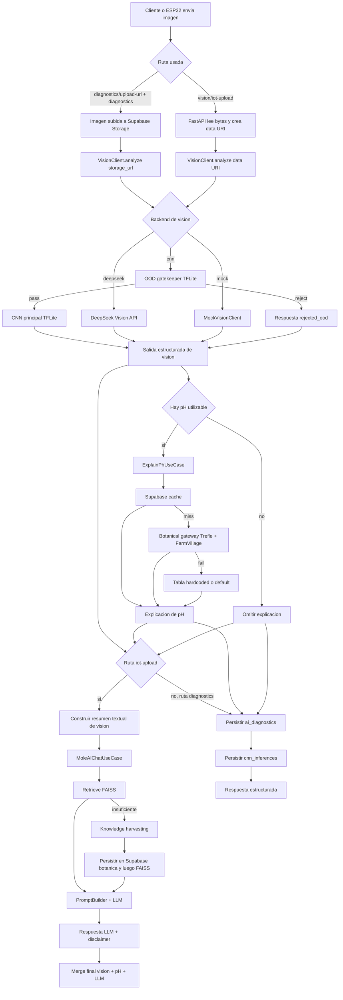

# AI Microservice Requirements and Technical Debt

Fecha: 16 de marzo de 2026

## 1. Resumen Ejecutivo

El microservicio `ai_rag_service` es un backend FastAPI con arquitectura hexagonal que concentra cuatro capacidades principales: inferencia de vision para diagnostico vegetal, explicabilidad hibrida de pH, recuperacion y ampliacion de conocimiento RAG, y generacion de recomendaciones con LLM. La implementacion actual ya soporta un pipeline funcional de inferencia y una ruta multimodal para IoT, pero no implementa un callback HTTP ni un `PATCH` directo hacia Django. El patron de integracion observado es distinto: el microservicio persiste resultados en Supabase mediante PostgREST y devuelve respuestas HTTP estructuradas para que el backend principal o el frontend las consuman.

La mayor restriccion operativa actual es la serializacion de inferencia TFLite por medio de `threading.Lock()`, lo que protege contra fallos del runtime de TFLite pero limita el throughput a una sola inferencia local por proceso. Tambien existen deudas relevantes en resiliencia externa, gestion de memoria, deserializacion de FAISS, almacenamiento ilimitado de negativos duros y un desacoplamiento incompleto del pipeline Two-Stream Merge, ya que la persistencia diagnostica y el enriquecimiento LLM viven en rutas distintas.

## 2. Alcance y Base de Evidencia

Este documento se basa en comportamiento verificable del codigo actual en:

- `ai_rag_service/app/main.py`
- `ai_rag_service/infrastructure/api/routes.py`
- `ai_rag_service/infrastructure/api/knowledge_routes.py`
- `ai_rag_service/infrastructure/api/contracts.py`
- `ai_rag_service/application/use_cases/create_diagnostic_use_case.py`
- `ai_rag_service/application/use_cases/explain_ph_use_case.py`
- `ai_rag_service/application/use_cases/mole_ai_chat_use_case.py`
- `ai_rag_service/application/use_cases/ingest_knowledge_use_case.py`
- `ai_rag_service/infrastructure/external/cnn_vision_client.py`
- `ai_rag_service/infrastructure/external/deepseek_vision_client.py`
- `ai_rag_service/infrastructure/external/supabase_storage.py`
- `ai_rag_service/infrastructure/database/supabase_diagnostic_repo.py`
- `ai_rag_service/infrastructure/database/supabase_knowledge_repo.py`
- `ai_rag_service/infrastructure/database/supabase_botanical_repo.py`
- `ai_rag_service/infrastructure/ai/vector_store.py`
- `ai_rag_service/infrastructure/data/pdf_parser.py`

Cuando el codigo no implementa una capacidad pedida por negocio, este documento la marca como ausencia real, no como requisito ya satisfecho.

## 3. Arquitectura Observable

### 3.1 Capas principales

- `app/main.py` inicializa FastAPI, middleware de seguridad, rate limiting, ciclo de vida y registro de rutas.
- `application/use_cases` contiene la orquestacion de negocio de chat, explainability, diagnostico e ingesta.
- `infrastructure/external` encapsula integraciones con DeepSeek, TFLite local, Supabase Storage y APIs botanicas externas.
- `infrastructure/database` encapsula persistencia PostgREST en Supabase.
- `infrastructure/ai/vector_store.py` implementa el almacenamiento y retrieval RAG con FAISS.

### 3.2 Backends de vision disponibles

La variable `VISION_BACKEND` activa tres variantes:

- `mock`: devuelve inferencia simulada.
- `deepseek`: usa `DeepSeekVisionClient` para analisis remoto de imagen.
- `cnn`: usa `CNNVisionClient` con TFLite local, gatekeeper OOD opcional y persistencia de negativos duros.

### 3.3 Patron real de integracion con el backend principal

No se identifico en `ai_rag_service` ninguna llamada `PATCH` o `POST` saliente hacia endpoints Django para actualizar un diagnostico. El retorno real al ecosistema es:

- respuesta HTTP sincrona desde FastAPI, o
- persistencia en tablas Supabase `ai_diagnostics` y `cnn_inferences`, descritas como tablas manejadas por Django ORM con `managed = False`.

Conclusión: hoy el microservicio no hace callback a Django; comparte resultados por datastore comun y por respuesta API.

## 4. Requisitos Funcionales Exhaustivos

### 4.1 FR-01. Exponer un endpoint de salud del servicio

El servicio debe responder estado de salud general y estado de modelos a traves de `GET /api/v1/health`.

Comportamiento observado:

- Ejecuta `GetServiceHealthUseCase`.
- Intenta un chequeo rapido de conectividad hacia `SUPABASE_URL` o `DATABASE_URL`.
- Devuelve `is_healthy`, `uptime_seconds`, `version` y `models_status`.
- Si la base no es alcanzable, marca el servicio degradado.

### 4.2 FR-02. Generar embeddings de texto

El servicio debe convertir texto a vectores mediante `POST /api/v1/embeddings`.

Comportamiento observado:

- Recibe `text` y un `model` opcional.
- Invoca `GenerateEmbeddingUseCase`.
- Devuelve `vector`, `dimension`, `model_used` y `processing_time_ms`.

### 4.3 FR-03. Generar respuesta agronomica enriquecida con RAG y alertas tacticas

El servicio debe responder preguntas agronomicas mediante `POST /api/v1/mole-ai/chat`.

Comportamiento observado:

- Convierte telemetria opcional en `SensorData`.
- Aplica guardrails de entrada y sanitizacion.
- Recupera contexto RAG con `top_k=3` desde FAISS.
- Si la calidad del RAG es insuficiente, intenta harvesting externo.
- Valida sensores y genera alertas tacticas.
- Detecta algunos cultivos por keywords y agrega contexto de cultivo.
- Consulta CONABIO para preguntas que parezcan taxonomicas.
- Construye prompt unico con `PromptBuilder`.
- Invoca LLM.
- Enriquece la respuesta con recetas agricolas, recomendaciones por cultivo y disclaimer legal.

### 4.4 FR-04. Hacer harvesting de conocimiento cuando el RAG local no es suficiente

El servicio debe ampliar la base de conocimiento cuando FAISS no devuelve chunks con score suficiente.

Comportamiento observado:

- Umbral de harvesting: `HARVEST_THRESHOLD = 0.35`.
- Consulta `botanical_gateway.fetch_tolerance(query)`.
- Genera un contenido sintetico con especie y rango de pH.
- Deduplica por hash SHA-256.
- Persiste primero en Supabase botanica y luego en FAISS.
- Si Supabase falla, no escribe en FAISS para evitar inconsistencia.
- Si FAISS falla despues de Supabase, deja deuda de reconciliacion manual.

### 4.5 FR-05. Ingerir PDFs para la base de conocimiento RAG

El servicio debe aceptar documentos PDF y convertirlos a chunks vectorizados mediante:

- `POST /api/v1/knowledge/ingest`
- `POST /api/v1/knowledge/ingest-pdf`

Comportamiento observado:

- Extrae texto con `pypdf`.
- Aplica chunking simple de `500` caracteres con `50` de overlap.
- Enriquece metadatos.
- Inserta los chunks en FAISS.
- Permite listar fuentes mediante `GET /api/v1/knowledge/sources`.

### 4.6 FR-06. Generar URLs firmadas para subida directa de imagenes diagnosticas

El servicio debe generar una URL firmada mediante `POST /api/v1/diagnostics/upload-url`.

Comportamiento observado:

- Usa `SupabaseStorageAdapter`.
- Devuelve `upload_url`, `storage_path` y `expires_in`.
- Permite que el cliente suba la imagen directamente al bucket sin que FastAPI procese los bytes.

### 4.7 FR-07. Ejecutar pipeline de diagnostico estructurado sobre imagen ya subida

El servicio debe correr un pipeline de diagnostico sobre una `storage_url` mediante `POST /api/v1/diagnostics`.

Comportamiento observado:

- Recibe `plant_id`, `storage_url` y `species_name` opcional.
- Ejecuta `CreateDiagnosticUseCase`.
- Invoca `vision_client.analyze(storage_url)`.
- Si hay valor de `ph_predicted`, ejecuta `ExplainPhUseCase`.
- Persiste un registro en `ai_diagnostics`.
- Persiste una traza de inferencia en `cnn_inferences`.
- Devuelve `diagnostic_id`, especie detectada, pH, condicion, severidad, confianza, recomendaciones e imagen.

### 4.8 FR-08. Ejecutar pipeline multimodal IoT con enriquecimiento LLM y exito parcial

El servicio debe aceptar una imagen directa desde ESP32-CAM mediante `POST /api/v1/vision/iot-upload`.

Comportamiento observado:

- Lee los bytes de la imagen en memoria.
- Construye un `data:` URI base64.
- Ejecuta el backend de vision seleccionado.
- Genera un resumen textual de vision con especie, condicion, severidad, confianza y pH estimado.
- Si existe pH, invoca `ExplainPhUseCase`.
- Usa el resumen como entrada para `MoleAIChatUseCase` y genera recomendaciones agronomicas con LLM.
- Si el LLM falla, la ruta devuelve `partial_success = true` y mantiene la salida de vision.
- Calcula `alert` si la severidad es alta o si el LLM incluyo una alerta tactica.

### 4.9 FR-09. Explicar el pH inferido por vision con una cadena auditable de razonamiento

El servicio debe explicar el valor de pH mediante `POST /api/v1/explain/ph`.

Comportamiento observado:

- Requiere `ph_cnn`, `plant_id`, `sensors` y `species_name` opcional.
- Verifica que `plant_id` exista en `user_plants`.
- Busca primero tolerancias de pH en Supabase.
- En cache miss, consulta gateway botanico externo.
- Si obtiene datos externos, intenta persistirlos en Supabase.
- Si todo falla, usa una tabla hardcoded o un default generico.
- Clasifica el pH como `optimal`, `warning` o `critical`.
- Cruza el resultado con alertas de sensores.
- Devuelve razonamiento, desviacion, recomendaciones, `confidence` y `data_sources`.

### 4.10 FR-10. Implementar gatekeeper OOD antes de la inferencia principal de vision local

El backend de vision local debe ejecutar un clasificador binario Plant vs Not-Plant antes del clasificador principal.

Comportamiento observado:

- Modelo opcional cargado desde `OOD_MODEL_PATH`.
- Umbral configurable `OOD_THRESHOLD`, default `0.60`.
- Si `plant_conf` cae por debajo del umbral, retorna una respuesta `rejected_ood` sin invocar la CNN principal.
- La respuesta rechazada mantiene contrato consistente con el puerto de vision.

### 4.11 FR-11. Persistir imagenes rechazadas por OOD para hard negative mining

El servicio debe almacenar imagenes rechazadas por OOD para reentrenamiento futuro.

Comportamiento observado:

- El guardado se hace en segundo plano con `asyncio.create_task()`.
- El destino es `OOD_REJECTED_DIR`, con default `/models/rejected`.
- El nombre del archivo incluye timestamp y confianza.
- Los fallos de persistencia se registran pero no rompen la respuesta.

### 4.12 FR-12. Proteger rutas sensibles por clave de servicio

El servicio debe proteger rutas inter-servicio e IoT.

Comportamiento observado:

- `/api/v1/mole-ai/**` exige `X-API-Key`.
- `/api/v1/vision/iot-upload` exige `X-Hardware-Api-Key`.
- Si faltan claves configuradas del lado servidor, responde `503`.
- Si las claves no coinciden, responde `401`.

### 4.13 FR-13. Devolver disclaimers regulatorios en respuestas de IA agronomica

El servicio debe inyectar un disclaimer legal al final de cada respuesta generada por el caso de uso `MoleAIChatUseCase`.

Comportamiento observado:

- El disclaimer se concatena a la respuesta final del LLM.
- El contenido advierte que la IA no sustituye criterio profesional agronomico o de salud.

## 5. Two-Stream Merge Realmente Implementado

### 5.1 Definicion operativa observada

El Two-Stream Merge no esta centralizado en una sola clase; hoy se materializa principalmente en `POST /api/v1/vision/iot-upload` y, en forma parcial, en la combinacion de `POST /api/v1/diagnostics` con `POST /api/v1/mole-ai/chat`.

### 5.2 Stream A: Vision estructurada

Entradas:

- imagen en `data:` URI base64 para `vision/iot-upload`, o
- `storage_url` de Supabase para `diagnostics`.

Transformaciones:

- descarga o lectura de imagen,
- OOD gatekeeper si `VISION_BACKEND=cnn`,
- clasificacion principal de especie/condicion/severidad/confianza,
- estimacion de pH segun backend de vision,
- explicacion de pH via `ExplainPhUseCase`.

Salidas:

- diccionario estructurado `vision_inference`,
- bloque `ph_explanation`,
- recomendaciones de pH para persistencia o respuesta.

### 5.3 Stream B: Razonamiento semantico con LLM

Entradas:

- resumen textual construido a partir de la salida de vision,
- contexto RAG y harvesting cuando aplica,
- alertas tacticas y contexto agricola.

Transformaciones:

- construccion de prompt,
- invocacion de LLM,
- enriquecimiento post-LLM,
- inyeccion de disclaimer legal.

Salidas:

- `llm_answer`,
- `alert`,
- `partial_success` si el LLM falla pero vision ya produjo salida util.

### 5.4 Merge actual paso a paso

1. El cliente envia imagen o URL de storage.
2. El backend de vision produce especie, condicion, severidad, confianza y un pH estimado o placeholder.
3. Si existe pH, `ExplainPhUseCase` resuelve tolerancia botanica y genera razonamiento blanco.
4. La ruta `vision/iot-upload` serializa ese resultado como resumen textual.
5. `MoleAIChatUseCase` consume ese resumen y genera recomendacion agronomica con LLM.
6. La respuesta final fusiona ambos streams en un payload unico.
7. En la ruta `diagnostics`, el merge termina antes del LLM y el resultado se persiste en Supabase.

### 5.5 Hallazgo critico sobre el requisito de PATCH a Django

El flujo solicitado por negocio menciona un `PATCH` de vuelta al backend Django. Ese comportamiento no existe en el codigo actual del microservicio.

Estado real:

- `CreateDiagnosticUseCase` hace `POST` a PostgREST de Supabase para `ai_diagnostics` y `cnn_inferences`.
- `vision/iot-upload` responde sin persistir diagnostico estructurado.
- No hay cliente HTTP saliente hacia endpoints Django para actualizar una entidad existente.

Implicacion:

El contrato actual es de persistencia compartida y respuesta sincrona, no de callback transaccional hacia Django.

## 6. Gatekeeper OOD y Hard Negative Mining

### 6.1 Flujo OOD observado

1. `CNNVisionClient.analyze()` descarga la imagen.
2. Lanza `_infer_pipeline()` en `asyncio.to_thread()`.
3. Dentro del lock global, ejecuta primero el interprete OOD si esta disponible.
4. Normaliza logits a probabilidades si hace falta.
5. Calcula `plant_conf`.
6. Si `plant_conf < OOD_THRESHOLD`, retorna `condition = rejected_ood` y omite la CNN principal.
7. Si pasa el gate, ejecuta la CNN principal y construye el resultado final.

### 6.2 Contrato del rechazo OOD

La respuesta de rechazo incluye:

- `species = Desconocida`
- `condition = rejected_ood`
- `description` con instruccion de intentar otra foto
- `predictions = [Not_Plant, Plant]`
- `confidence_scores` con probabilidades binarias

### 6.3 Hard Negative Mining observado

Cuando la imagen es rechazada por OOD:

- se dispara una tarea asincrona no bloqueante,
- se persiste la imagen original rechazada,
- no existe TTL, cuota de disco ni job de purga,
- el almacenamiento sirve como dataset de negativos duros para reentrenamiento.

## 7. Requisitos No Funcionales, Restricciones y Limites Operativos

### 7.1 Rendimiento y concurrencia

#### Restricciones observadas

- El interprete TFLite local no es thread-safe y la implementacion lo protege con `threading.Lock()`.
- El lock envuelve tanto el gatekeeper OOD como la CNN principal.
- El trabajo CPU-bound se desplaza a threads con `asyncio.to_thread()` para no bloquear el event loop.
- No se observaron semaforos, colas de backpressure ni pool dedicado de inferencia dentro del microservicio.

#### Implicacion operativa

- En `VISION_BACKEND=cnn`, cada proceso de FastAPI solo puede ejecutar una inferencia local a la vez.
- Bajo carga concurrente, la latencia escala con la cola interna del proceso y no con paralelismo real.

#### Latencias codificadas o inferibles por timeout

- DeepSeek Vision: `10s` connect, `30s` read, `10s` write, `10s` pool.
- Descarga de imagen en `CNNVisionClient`: `10s`.
- `plant_exists` en Supabase: `5s`.
- `save_diagnostic` y `save_cnn_inference`: `10s`.
- No existe un SLA formal codificado para el pipeline total.

### 7.2 Escalabilidad y memoria

#### Limites observados

- Entrada de vision local redimensionada a `224x224`.
- Ingestion PDF limitada a `20 MB` solo en `knowledge/ingest-pdf`.
- `vision/iot-upload` lee la imagen completa en memoria y no define tamano maximo.
- FAISS se persiste en disco local bajo `VECTOR_DB_PATH`.
- Embeddings HuggingFace se cargan de forma lazy en la primera consulta.
- Modelos TFLite se cargan eager en el constructor del cliente CNN.
- El shutdown invoca `unload_all_models()` y cierra el cliente HTTP compartido.

#### Restricciones no implementadas

- No hay limite maximo de RAM por proceso.
- No hay cuota o purga para `OOD_REJECTED_DIR`.
- No hay limite maximo de tamano de imagen para rutas de vision.
- No hay control de cold start para embeddings concurrentes.

### 7.3 Tolerancia a fallos y degradacion

#### Vision externa

- Si DeepSeek hace timeout o devuelve error HTTP, el cliente retorna un `error_dict` contrato-compatible.
- No existe retry, exponential backoff, circuit breaker ni fallback automatico a otro backend durante la misma peticion.

#### LLM en ruta IoT

- Si el LLM falla despues de obtener vision, la ruta devuelve `partial_success = true`.
- Esto evita dejar al usuario sin diagnostico base.

#### Explainability botanica

- Orden de fallback: Supabase de tolerancias -> gateway botanico externo -> tabla hardcoded -> default seguro.
- Si la persistencia de tolerancias externas falla, el flujo continua y devuelve explicacion.

#### Persistencia diagnostica

- Si `save_diagnostic()` falla, la ruta diagnostica termina en error.
- Si `save_cnn_inference()` falla, retorna `0` y no revierte el diagnostico ya persistido.

### 7.4 Seguridad operativa

- Claves de servicio para rutas inter-servicio e IoT.
- Guardrails basicos de prompt injection en `MoleAIChatUseCase`.
- Sanitizacion de contexto.
- Validacion Pydantic de rangos para sensores y payloads.
- Riesgo abierto en FAISS por `allow_dangerous_deserialization=True`.

### 7.5 Observabilidad

- Logging presente en casos de uso y adaptadores.
- No se observaron metricas Prometheus, tracing distribuido ni correlacion de request IDs.
- La telemetria es suficiente para debugging basico, no para operacion masiva ni SRE.

## 8. Diagrama Conceptual del Pipeline

## 9. Matriz de Deuda Tecnica y Plan de Mitigacion

| ID | Deuda actual | Evidencia | Impacto | Severidad | Mitigacion recomendada | Horizonte |
|---|---|---|---|---|---|---|
| DT-01 | Inference local serializada por `threading.Lock()` | `CNNVisionClient._invoke_lock` protege OOD + CNN | Throughput lineal y latencia creciente bajo concurrencia | Alta | Mover inferencia pesada a worker pool por procesos separados; mantener FastAPI como orchestrator y cola de entrada | Corto |
| DT-02 | No existe callback ni `PATCH` a Django | No hay cliente HTTP saliente hacia Django; solo PostgREST a Supabase | El contrato de integracion es implicito y puede romper expectativas de negocio | Alta | Definir contrato formal de integracion: callback HTTP firmado o polling/event sourcing sobre Supabase | Corto |
| DT-03 | `CNNVisionClient` devuelve `ph = 0.0` aunque el comentario indica que no puede estimarlo | `_postprocess()` fija `ph: 0.0`; `CreateDiagnosticUseCase` trata `0.0` como valor valido | Explainability puede producir recomendaciones criticas sobre un pH ficticio | Alta | Cambiar placeholder a `None` y condicionar explainability solo a pH realmente inferido | Corto |
| DT-04 | FAISS usa `allow_dangerous_deserialization=True` | `_load_vectorstore()` | Riesgo de seguridad por deserializacion insegura | Alta | Migrar a pgvector o eliminar deserializacion peligrosa con formato seguro | Corto |
| DT-05 | Embeddings lazy-load sin sincronizacion | `_ensure_embeddings()` sin lock | Race condition, cold start alto y posible duplicacion de carga | Media | Agregar `asyncio.Lock()` o eager load controlado en startup | Corto |
| DT-06 | Contenedor global mutable `deps` | Inyeccion en `app/main.py` y lectura en rutas | Acoplamiento, baja testabilidad y riesgos en multiproceso | Media | Reemplazar por contenedor DI tipado con ciclo de vida explicito | Medio |
| DT-07 | Sin retries, backoff ni circuit breaker para DeepSeek, Supabase y APIs botanicas | Clientes HTTP capturan error y degradan, pero no reintentan | Caidas transitorias se convierten en fallos funcionales | Alta | Implementar politicas de retry con jitter y circuit breaker por dependencia | Corto |
| DT-08 | Hard negative mining sin quota ni retencion | `_save_ood_image()` persiste indefinidamente en disco | Riesgo de agotamiento de disco y abuso por trafico malicioso | Alta | Definir TTL, tamano maximo, job de purga y almacenamiento externo versionado | Corto |
| DT-09 | `vision/iot-upload` lee la imagen completa en memoria y no limita tamano | `await file.read()` sin validacion de size | Riesgo de OOM y DoS por archivos grandes | Alta | Agregar validacion de content-length, limite de bytes y streaming a almacenamiento temporal | Corto |
| DT-10 | `save_cnn_inference()` no revierte ni compensa si falla luego del diagnostico | `save_diagnostic()` falla fuerte, `save_cnn_inference()` devuelve `0` | Persistencia parcial y auditoria incompleta | Media | Introducir outbox o estado de reconciliacion para subpasos de persistencia | Medio |
| DT-11 | Two-Stream Merge partido entre rutas | `vision/iot-upload` hace LLM; `diagnostics` solo persiste estructurado | Doble contrato de negocio, mayor complejidad de clientes y pruebas | Media | Crear un orchestrator unificado con modos `persist_only`, `advise_only`, `persist_and_advise` | Medio |
| DT-12 | Observabilidad insuficiente para produccion masiva | Solo logs aplicativos | Dificulta capacity planning, SLOs y debugging distribuido | Media | Agregar metricas, tracing y correlacion por request ID | Medio |

## 10. Estrategia de Mitigacion Arquitectonica

### 10.1 Antes de produccion masiva

1. Corregir el contrato de pH del backend CNN para eliminar `0.0` como falso positivo.
2. Introducir limite duro de tamano de imagen y politica de almacenamiento para hard negatives.
3. Implementar retries con jitter y circuit breaker para DeepSeek y APIs botanicas.
4. Formalizar el mecanismo de retorno al backend principal: callback firmado, evento o polling.
5. Remover la deserializacion peligrosa de FAISS.

### 10.2 Escalado de inferencia

1. Mantener FastAPI para autenticacion, validacion, control de flujo y composicion de respuesta.
2. Extraer la inferencia TFLite pesada a workers separados por proceso, con una cola externa.
3. Permitir que cada worker cargue su propio interprete TFLite y procese una peticion a la vez.
4. Escalar horizontalmente por numero de workers, no por threads dentro del mismo interprete.
5. Reservar el modo inline actual solo para desarrollo, QA o trafico muy bajo.

### 10.3 Evolucion del RAG

1. Migrar FAISS local a pgvector o un vector store administrado si la persistencia debe ser segura y distribuida.
2. Separar claramente conocimiento operativo permanente de conocimiento harvested transitorio.
3. Agregar reconciliacion automatica cuando Supabase persista pero FAISS falle, o viceversa en la futura version.

## 11. Respuesta Arquitectonica a la Pregunta de Concurrencia

Pregunta: con `threading.Lock()` serializando TFLite, para cientos de usuarios concurrentes, conviene `Worker Pool` o batch inference dentro de FastAPI.

Recomendacion: priorizar `Worker Pool` y no batch inference como estrategia principal.

Razonamiento:

- El cuello de botella actual es el interprete TFLite no thread-safe, no el event loop de FastAPI.
- Batch inference ayuda cuando el modelo y el patron de trafico permiten agrupar solicitudes sin penalizar SLA interactivo; ese no es el caso dominante de diagnostico agricola bajo demanda.
- Un worker pool por procesos aísla interpretes, escala horizontalmente y permite backpressure observable.
- FastAPI debe quedarse como capa de orquestacion y entrega, no como scheduler de lotes pesados.

Patron recomendado:

1. FastAPI recibe la solicitud, autentica y valida.
2. Si la carga es baja, puede ejecutar inline solo en entornos controlados.
3. Si la carga es media o alta, publica el trabajo en una cola.
4. Workers separados ejecutan OOD, CNN, explainability y persistencia.
5. El cliente consume resultado sincrono corto o asincrono segun SLA.

Conclusión: para el escenario descrito, `Worker Pool` es la estrategia correcta. Batch inference solo deberia introducirse despues, para cargas offline o flujos agrupables como re-procesamiento historico, no como sustituto del escalado interactivo.

## 12. Checklist de Cierre

- FRs documentados a partir de endpoints y casos de uso reales.
- Two-Stream Merge documentado segun implementacion real, no supuesta.
- Flujo OOD y hard negative mining documentados.
- Restricciones de concurrencia, memoria y timeouts explicitadas.
- Caidas de DeepSeek y degradacion parcial documentadas.
- Matriz de deuda y mitigacion priorizada incluida.
- Ausencia de `PATCH` a Django marcada como gap real.
