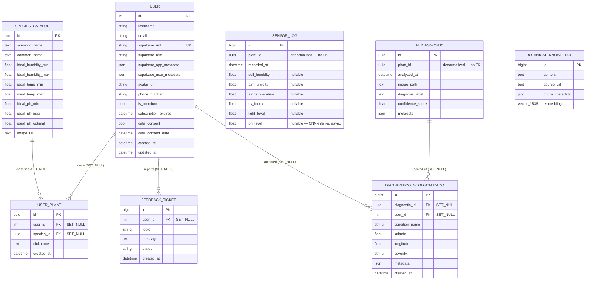

# Django Backend — Requirements, Architecture & Technical Debt Report

> **Proyecto:** Mole.AI — Plataforma de Inteligencia Agrícola  
> **Alcance:** Backend principal Django (`apps/core`, `apps/authentication`, `apps/plants`)  
> **Fecha:** 16 de marzo de 2026  
> **Autor:** Senior Backend Architect (Auditoría automatizada)  
> **Estado:** Auditoría completada — aprobado para ejecución de plan de migración

---

## Tabla de Contenidos

1. [Alcance y Metodología](#1-alcance-y-metodología)
2. [Requisitos Funcionales (FRs)](#2-requisitos-funcionales-frs)
3. [Requisitos No Funcionales (NFRs)](#3-requisitos-no-funcionales-nfrs)
4. [Mapa de Autenticación: JWT vs API Key M2M](#4-mapa-de-autenticación-jwt-vs-api-key-m2m)
5. [Diagrama Entidad-Relación (ERD)](#5-diagrama-entidad-relación-erd)
6. [Mapa Completo de Endpoints](#6-mapa-completo-de-endpoints)
7. [Matriz de Deuda Técnica](#7-matriz-de-deuda-técnica)
8. [Análisis Profundo: Schema Drift](#8-análisis-profundo-schema-drift)
9. [Análisis Profundo: Two-Stream Merge (Endpoint PATCH Faltante)](#9-análisis-profundo-two-stream-merge-endpoint-patch-faltante)
10. [Recomendación de Estrategia de Migración: Squash vs Historial](#10-recomendación-de-estrategia-de-migración-squash-vs-historial)
11. [Plan de Remediación Priorizado](#11-plan-de-remediación-priorizado)

---

## 1. Alcance y Metodología

### Archivos Analizados

| Módulo | Archivos clave |
|--------|---------------|
| `apps/core` | `infrastructure/repositories/models.py`, `presentation/views.py`, `presentation/serializers.py`, `presentation/urls.py`, `presentation/throttles.py`, `domain/entities.py`, `application/services.py`, `services/pdf_generator.py`, migraciones `0001`–`0007` |
| `apps/authentication` | `infrastructure/authentication.py`, `infrastructure/repositories/models.py`, `presentation/views.py`, `presentation/urls.py`, `middleware.py`, `jwks.py`, migraciones `0001`–`0002` |
| `apps/plants` | `infrastructure/repositories/models.py`, `presentation/views.py`, `presentation/serializers.py`, `presentation/urls.py`, migración `0001` |
| Config | `mole_ai_backend/settings.py`, `mole_ai_backend/urls.py` |

### Metodología

Análisis estático del código fuente: modelos ORM, serializers DRF, vistas, middlewares, migraciones y domain entities. Cada FR/NFR está vinculado al archivo y línea exacta del código que lo implementa.

---

## 2. Requisitos Funcionales (FRs)

### FR-01 · Ingesta IoT Single (ESP32 → Django)

| Atributo | Valor |
|----------|-------|
| **Endpoint** | `POST /api/v1/sensor-data/` |
| **Auth** | `X-Hardware-Api-Key` (M2M) — `HardwareAPIKeyAuthentication` + `HardwareOnlyPermission` |
| **Serializer** | `SensorReadingSerializer` (Wide-Table: `plant_id`, `recorded_at`, `soil_humidity`, `air_humidity`, `air_temperature`, `uv_index`, `light_level`, `ph_level`) |
| **Anti-Replay** | **SÍ** — ventana estricta de 60s + 5s tolerancia NTP (ETSI EN 303 645) |
| **Validación** | Al menos un campo sensor no-null; `plant_id` debe existir en `UserPlant` |
| **Persistencia** | `SensorLog.objects.create(...)` → tabla `sensor_logs` |
| **Response** | `201 Created` con `{status, plant_id, recorded_at, registered: 1}` |
| **Código fuente** | `apps/core/presentation/views.py:sensor_data_view` |

### FR-02 · Ingesta IoT Batch (Store-and-Forward)

| Atributo | Valor |
|----------|-------|
| **Endpoint** | `POST /api/v1/sensor-data/batch/` |
| **Auth** | `X-Hardware-Api-Key` (M2M) |
| **Serializer** | `SensorBatchSerializer` → `SensorBatchReadingSerializer` (max 500 por push) |
| **Anti-Replay** | **NO** — exento por diseño (daemon offline acumula lecturas) |
| **Validación** | Todos los `plant_id` deben existir en `UserPlant`; al menos un sensor no-null por lectura |
| **Persistencia** | `bulk_create(logs, batch_size=200)` dentro de `transaction.atomic()` |
| **Response** | `201 Created` con `{status, total_sent, registered}` |
| **Código fuente** | `apps/core/presentation/views.py:sensor_batch_view` |

### FR-03 · Mock Sensor Data (Dev)

| Atributo | Valor |
|----------|-------|
| **Endpoint** | `GET /api/v1/sensor-data/latest/` |
| **Propósito** | Datos simulados para desarrollo frontend |
| **Código fuente** | `apps/core/api_views.py:mock_sensor_data` |

### FR-04 · Gestión de Usuarios (Supabase Auth)

| Atributo | Valor |
|----------|-------|
| **Login/Handshake** | `POST /api/v1/auth/validate-token/` — recibe JWT de Supabase, valida con JWKS, crea/actualiza `User` local |
| **Perfil** | `GET/PATCH /api/v1/auth/profile/` — lectura y actualización de campos mutables (`first_name`, `last_name`, `avatar_url`, `phone_number`) |
| **ARCO Delete** | `DELETE /api/v1/auth/profile/` — anonimiza PII (`email → deleted_N@anonimizado.mole.ai`, `first_name/last_name → ""`, `phone_number/avatar_url → null`), desactiva cuenta, flush de sesión, ejecuta `user.delete()` → `SET_NULL` propaga a FKs |
| **Suscripción** | `GET/PUT /api/v1/auth/subscription/` — GET devuelve estado; PUT reservado para webhook de pagos |
| **Metadata** | `GET /api/v1/auth/metadata/` — expone claims JWT de Supabase |
| **Logout** | `POST /api/v1/auth/logout/` — flush de sesión Django |
| **Modelo** | `User(AbstractUser)`: `supabase_uid`, `supabase_role`, `data_consent`, `data_consent_date`, `is_premium`, `subscription_expires` |
| **Código fuente** | `apps/authentication/presentation/views.py`, `apps/authentication/infrastructure/authentication.py` |

### FR-05 · Gestión de Plantas (CRUD)

| Atributo | Valor |
|----------|-------|
| **List/Create** | `GET/POST /api/v1/plants/` — listar plantas del usuario, crear nueva con UUID auto-generado |
| **Detail/Update/Delete** | `GET/PATCH/DELETE /api/v1/plants/<uuid>/` — detalle, actualización parcial, borrado |
| **Modelo** | `UserPlant`: `id` (UUID PK), `user` (FK → `User`, `SET_NULL`), `species` (FK → `SpeciesCatalog`, `SET_NULL`), `nickname` |
| **Especies** | `SpeciesCatalog`: `scientific_name`, `common_name`, rangos ideales (`ideal_ph_min/max/optimal`, `ideal_humidity_min/max`, `ideal_temp_min/max`) |
| **Código fuente** | `apps/plants/presentation/views.py`, `apps/plants/infrastructure/repositories/models.py` |

### FR-06 · Diagnósticos IA (Vision Pipeline)

| Atributo | Valor |
|----------|-------|
| **Create** | `POST /api/v1/diagnostics/` — recibe imagen (max 10 MB, JPEG/PNG/WebP), invoca DeepSeek-VL, heurística de severidad, persiste `AIDiagnostic` + opcional `DiagnosticoGeolocalizado` con coordenadas |
| **History** | `GET /api/v1/diagnostics/history/` — historial paginado por usuario |
| **PDF Download** | `GET /api/v1/diagnostics/<uuid>/download/` — genera PDF branded con ReportLab |
| **Modelo** | `AIDiagnostic`: `id` (UUID PK), `plant_id` (UUID denormalizado), `analyzed_at`, `image_path`, `diagnosis_label`, `confidence_score`, `metadata` (JSON) |
| **Código fuente** | `apps/core/presentation/views.py:diagnostic_view`, `apps/core/services/pdf_generator.py` |

### FR-07 · Hotspots / Mapa Geolocalizado

| Atributo | Valor |
|----------|-------|
| **Hotspots** | `GET /api/v1/map/hotspots/` — agregación geoespacial sobre `DiagnosticoGeolocalizado` |
| **CRUD Geolocalizado** | `GET /api/v1/diagnosticos/geolocalizados/`, `POST /api/v1/diagnosticos/geolocalizados/create/` |
| **Modelo** | `DiagnosticoGeolocalizado`: FK → `AIDiagnostic` (`SET_NULL`), FK → `User` (`SET_NULL`), `latitude`, `longitude`, `severity`, `condition_name` |
| **Serializer** | `HotspotSerializer`: `latitud_centro`, `longitud_centro`, `radio_estimado_metros`, `total_casos`, `plaga_predominante`, `severity_index` |
| **Código fuente** | `apps/core/presentation/views.py:map_hotspots_view`, `diagnosticos_geolocalizados_*` |

### FR-08 · Historial Consolidado (Sensor + Diagnóstico)

| Atributo | Valor |
|----------|-------|
| **Endpoint** | `GET /api/v1/history/` |
| **Propósito** | Fusiona `SensorLog` + `AIDiagnostic` del usuario, ordenados cronológicamente, con paginación (`PageNumberPagination`, page_size=50) |
| **Límite** | 1 000 registros máx. por tipo (memory-safe) |
| **Código fuente** | `apps/core/presentation/views.py:consolidated_history_view` |

### FR-09 · Feedback (Tickets de agricultores)

| Atributo | Valor |
|----------|-------|
| **Endpoint** | `POST /api/v1/feedback/` |
| **Serializer** | `FeedbackTicketCreateSerializer`: `topic` (bug/suggestion/ai_error/other), `message` (10–5 000 chars) |
| **Modelo** | `FeedbackTicket`: FK → `User` (`SET_NULL`), `topic`, `message`, `status` (open/in_progress/closed) |
| **Código fuente** | `apps/core/presentation/views.py:feedback_create_view` |

### FR-10 · Chat LLM y Fallback HTTP

| Atributo | Valor |
|----------|-------|
| **LLM Chat** | `POST /api/v1/llm/chat/` — Mock/LLM, throttled (`LLMChatThrottle`) |
| **HTTP Fallback** | `POST /api/v1/chat/fallback/` — async view para cuando WebSocket no disponible; delega a `MoleAIClient` (microservicio FastAPI) |
| **Código fuente** | `apps/core/presentation/views.py:llm_chat_view`, `chat_fallback_view` |

### FR-11 · Health Check

| Atributo | Valor |
|----------|-------|
| **Endpoint** | `GET /api/v1/health/` |
| **Response** | `{status: "healthy", timestamp, version: "1.0.1", service: "Mole AI Backend"}` |

### FR-12 ⚠️ Two-Stream Merge (FALTANTE — Deuda Técnica Alta)

| Atributo | Valor |
|----------|-------|
| **Endpoint necesario** | `PATCH /api/v1/sensor-data/<id>/` |
| **Propósito** | Permitir al microservicio de IA inyectar el `ph_level` inferido por CNN/TFLite en un `SensorLog` existente |
| **Estado actual** | **No existe.** No hay endpoint de actualización parcial en las URLs de `core` |
| **Impacto** | El flujo Two-Stream Merge (telemetría + inferencia IA) queda incompleto |
| **Plan** | Ver [Sección 9](#9-análisis-profundo-two-stream-merge-endpoint-patch-faltante) y `MIGRATION_AND_PATCH_ACTION_PLAN.md` |

---

## 3. Requisitos No Funcionales (NFRs)

### NFR-SEC-01 · Autenticación Dual

| Mecanismo | Implementación | Evidencia |
|-----------|---------------|-----------|
| **JWT Supabase (Humanos)** | `SupabaseAuthentication` — valida HS256 (JWT secret) o ES256 (JWKS); crea/actualiza `User` local; audience=`authenticated` | `apps/authentication/infrastructure/authentication.py:22–126` |
| **JWKS Cache** | TTL 3 600s, `threading.Lock`, re-fetch on cache miss | `apps/authentication/jwks.py:36–40`, `get_verification_key()` |
| **API Key M2M (Hardware)** | `HardwareAPIKeyAuthentication` — `hmac.compare_digest()` constant-time compare contra `settings.HARDWARE_API_KEY` | `apps/authentication/infrastructure/authentication.py:133–200` |
| **WebSocket Auth** | `JwtAuthMiddleware` — token en query string `?token=<jwt>` | `apps/authentication/middleware.py:62–90` |

### NFR-SEC-02 · Anti-Replay ETSI EN 303 645

| Parámetro | Valor | Evidencia |
|-----------|-------|-----------|
| `REPLAY_WINDOW_SECONDS` | 60 | `apps/core/presentation/serializers.py:20` |
| `CLOCK_SKEW_TOLERANCE_SECONDS` | 5 | `apps/core/presentation/serializers.py:21` |
| **Scope** | Solo endpoint single (`POST /api/v1/sensor-data/`) | `SensorReadingSerializer.validate_recorded_at()` |
| **Batch exento** | `SensorBatchReadingSerializer` — no implementa `validate_recorded_at` | Por diseño: daemon store-and-forward offline |

### NFR-SEC-03 · Rate Limiting (DRF Throttles)

| Scope | Rate | Clase |
|-------|------|-------|
| `anon` | 100/hour | DRF `AnonRateThrottle` |
| `user` | 1 000/hour | DRF `UserRateThrottle` |
| `llm_chat` | 60/minute | `LLMChatThrottle` |
| `diagnostics` | 30/minute | `DiagnosticsThrottle` |
| `sensor_data` | 200/minute | `SensorDataThrottle` (definida pero no aplicada en vistas IoT) |

### NFR-PERF-01 · Wide-Table + Bulk Insert

| Aspecto | Implementación |
|---------|---------------|
| **Patrón** | Wide-table: cada columna de sensor (`soil_humidity`, `air_humidity`, `air_temperature`, `uv_index`, `light_level`, `ph_level`) es un `FloatField(null=True)` directo en `SensorLog`. Evita joins EAV. |
| **Single insert** | `SensorLog.objects.create(...)` — un INSERT por request |
| **Bulk insert** | `SensorLog.objects.bulk_create(logs, batch_size=200)` dentro de `transaction.atomic()` — reduce overhead por fila |
| **Límite batch** | 500 lecturas por push (enforced en serializer `SensorBatchSerializer.max_length=500`) |

### NFR-PRIVACY-01 · LFPDPPP / Derechos ARCO

| Mecanismo | Implementación |
|-----------|---------------|
| **Consentimiento explícito** | `User.data_consent` (BooleanField) + `User.data_consent_date` (DateTimeField nullable) |
| **Derecho de Cancelación** | `DELETE /api/v1/auth/profile/` → anonimiza PII, desactiva, luego `user.delete()` |
| **Retención de datos científicos** | FK con `on_delete=SET_NULL` en `UserPlant.user`, `DiagnosticoGeolocalizado.user`, `FeedbackTicket.user` — preserva telemetría y diagnósticos desvinculados |
| **Denormalización intencional** | `SensorLog.plant_id` y `AIDiagnostic.plant_id` son UUID sin FK — inmunes al borrado de usuario |

### NFR-AVAIL-01 · Resiliencia ante fallos externos

| Servicio externo | Manejo de fallos |
|-----------------|-----------------|
| **DeepSeek-VL** | `diagnostic_view` captura `Timeout → 408`, `ConnectionError → 503`, `Exception → 500` |
| **MoleAI (FastAPI)** | `chat_fallback_view` detecta `MoleAIServiceError` con heurística de timeout → `504` |
| **JWKS (Supabase)** | `requests.get()` con `timeout=10`; cache evita re-fetch cada request |

---

## 4. Mapa de Autenticación: JWT vs API Key M2M

```
┌─────────────────┐  Bearer JWT    ┌────────────────────────────────────┐
│  Mobile / Web   │───────────────▶│  SupabaseAuthentication            │
│  (Agricultor)   │                │  → jwt.decode(ES256/HS256)         │
└─────────────────┘                │  → get_or_create(User)             │
                                   │  → IsAuthenticated permission      │
                                   └────────────────────────────────────┘

┌─────────────────┐ X-Hardware-    ┌────────────────────────────────────┐
│  ESP32 / Edge   │  Api-Key       │  HardwareAPIKeyAuthentication      │
│  Node (IoT)     │───────────────▶│  → hmac.compare_digest()           │
└─────────────────┘                │  → HardwareDevice (anon object)    │
                                   │  → HardwareOnlyPermission          │
                                   └────────────────────────────────────┘

┌─────────────────┐  ?token=<jwt>  ┌────────────────────────────────────┐
│  WebSocket      │───────────────▶│  JwtAuthMiddleware (Channels)      │
│  Client         │                │  → JWKS validation                 │
└─────────────────┘                │  → scope['user'] = User / Anonymous│
                                   └────────────────────────────────────┘
```

**Segregación crítica:** Los endpoints IoT (`/sensor-data/`, `/sensor-data/batch/`) rechazan tokens JWT. La clase `HardwareOnlyPermission` verifica `request.user.is_hardware_device == True`, lo que impide que un usuario humano autenticado con JWT inyecte telemetría directamente.

---

## 5. Diagrama Entidad-Relación (ERD)



### Notas Arquitectónicas del ERD

1. **`SensorLog` y `AIDiagnostic` no tienen FK a `UserPlant` ni a `User`.** El `plant_id` es un `UUIDField` denormalizado deliberadamente. Esto garantiza que la telemetría y los diagnósticos sobreviven intactos al borrado de usuarios o plantas (LFPDPPP Art. 24).

2. **Todas las FK a `User` usan `on_delete=SET_NULL`**, excepto en la migración original de `FeedbackTicket` que usaba `CASCADE` y fue corregida a `SET_NULL` en la migración `0007`.

3. **`BotanicalKnowledge`** usa `VectorField(dimensions=1536)` de `pgvector` — requiere PostgreSQL con extensión `pgvector` habilitada. En SQLite local este campo es ignorado silenciosamente.

---

## 6. Mapa Completo de Endpoints

### `apps/core` — Prefijo `/api/v1/`

| Método | Ruta | Auth | Vista | Descripción |
|--------|------|------|-------|-------------|
| POST | `sensor-data/` | HW API Key | `sensor_data_view` | Ingesta single + anti-replay |
| POST | `sensor-data/batch/` | HW API Key | `sensor_batch_view` | Ingesta bulk (max 500) |
| GET | `sensor-data/latest/` | — | `mock_sensor_data` | Dev mock |
| GET | `sensor-logs/` | JWT | `sensor_log_view` | Query con filtros |
| POST | `diagnostics/` | JWT | `diagnostic_view` | Vision pipeline |
| GET | `diagnostics/history/` | JWT | `diagnostic_history_view` | Historial por usuario |
| GET | `diagnostics/<uuid>/download/` | JWT | `download_diagnostic_pdf` | Descarga PDF |
| GET | `diagnosticos/geolocalizados/` | JWT | `diagnosticos_geolocalizados_list` | Listado geo |
| POST | `diagnosticos/geolocalizados/create/` | JWT | `diagnosticos_geolocalizados_create` | Crear geo manual |
| GET | `map/hotspots/` | JWT | `map_hotspots_view` | Mapa de hotspots |
| GET | `plant-knowledge/` | JWT | `plant_knowledge_view` | Query base botánica |
| POST | `llm/chat/` | JWT | `llm_chat_view` | Chat LLM |
| POST | `chat/fallback/` | JWT | `chat_fallback_view` | Fallback HTTP (async) |
| GET | `health/` | — | `health_check_view` | Health check |
| GET | `history/` | JWT | `consolidated_history_view` | Historial fusionado |
| POST | `feedback/` | JWT | `feedback_create_view` | Crear ticket |
| **PATCH** | **`sensor-data/<id>/`** | **--- FALTANTE ---** | — | **Two-Stream Merge — DT-02** |

### `apps/authentication` — Prefijo `/api/v1/auth/`

| Método | Ruta | Auth | Vista | Descripción |
|--------|------|------|-------|-------------|
| POST | `validate-token/` | — | `validate_token_view` | Login handshake JWT |
| GET/PATCH/DELETE | `profile/` | JWT | `user_profile_view` | Perfil + ARCO Delete |
| GET/PUT | `subscription/` | JWT | `user_subscription_view` | Suscripción |
| GET | `metadata/` | JWT | `user_metadata_view` | Claims Supabase |
| POST | `logout/` | JWT | `logout_view` | Cerrar sesión |

### `apps/plants` — Prefijo `/api/v1/plants/`

| Método | Ruta | Auth | Vista | Descripción |
|--------|------|------|-------|-------------|
| GET/POST | `/` | JWT | `plant_list_view` | Listar/crear plantas |
| GET/PATCH/DELETE | `<uuid>/` | JWT | `plant_detail_view` | CRUD de planta |

---

## 7. Matriz de Deuda Técnica

| ID | Severidad | Título | Evidencia | Impacto | Estado |
|----|-----------|--------|-----------|---------|--------|
| **DT-01** | **CRITICAL** | Schema Drift — migraciones inconsistentes (`managed=False` vs `True`) | Migraciones `0003` (sets `managed=False`) vs `0005`/`0007` (reverts a `managed=True`) | Django puede generar migraciones no-op; esquema local puede divergir de producción | ABIERTO — ver [Sección 8](#8-análisis-profundo-schema-drift) |
| **DT-02** | **HIGH** | Endpoint PATCH faltante para Two-Stream Merge | No existe `PATCH /sensor-data/<id>/` en `urls.py` ni en `views.py` | El microservicio IA no puede inyectar `ph_level` inferido en `SensorLog` existentes | ABIERTO — ver [Sección 9](#9-análisis-profundo-two-stream-merge-endpoint-patch-faltante) |
| **DT-03** | **HIGH** | SQLite dev vs PostgreSQL prod oculta errores | `settings.py:117` — `DEBUG=True → SQLite`; `pgvector.VectorField` en `BotanicalKnowledge` ignorado en SQLite | Tests pasan localmente pero pueden fallar en prod; columnas fantasma posibles | ABIERTO |
| **DT-04** | **MEDIUM** | `SensorDataThrottle` definido pero no aplicado | `throttles.py:21` define `SensorDataThrottle`; vistas IoT no lo decoran | Endpoints de ingesta sin rate limiting a nivel DRF | ABIERTO |
| **DT-05** | **MEDIUM** | `SensorLog` migración `0006` agrega `ph_level` + `air_humidity` sobre modelo que fue `managed=False` en `0003` | `0003`: `managed=False` → `0005`: `managed=True` → `0006`: `AddField` | `AddField` sobre tabla que puede no existir si `managed=False` estaba activo | Parcialmente resuelto por `0007` |
| **DT-06** | **MEDIUM** | `AIDiagnostic` usado en views con campos inexistentes en modelo actual | `views.py:260` → `AIDiagnostic.objects.create(user=..., diagnostic_type=..., condition_name=...)` — campos eliminados en migración `0005` | Runtime `FieldError` si se ejecuta `diagnostic_view` contra el modelo actual `AIDiagnostic` | ABIERTO — views desactualizadas |
| **DT-07** | **LOW** | `FavoritePlant` modelo comentado | `apps/plants/infrastructure/repositories/models.py:77–93` — código comentado pendiente de activar | Funcionalidad de favoritos no disponible | ABIERTO — no bloqueante |
| **DT-08** | **LOW** | `consolidated_history_view` carga hasta 2 000 objetos en memoria | `views.py:~810` — `[:1000]` por tipo = hasta 2 000 en lista Python sin streaming | Potencial OOM bajo carga con muchos sensores/diagnósticos | ABIERTO |
| **DT-09** | **LOW** | Variables no utilizadas en `chat_fallback_view` | `data.get('plant_id')` resultado no asignado a variable | Code smell menor | ABIERTO |

---

## 8. Análisis Profundo: Schema Drift

### Cronología de Migraciones de `SensorLog`

```
0001_initial
  └─ SensorLog ORIGINAL: device_id, sensor_type, value, unit, plant_id(CharField),
     timestamp, user(FK CASCADE), location_x/y/z
     managed=True, db_table='sensor_logs'

0002_alter_sensorlog_sensor_type_and_more
  └─ Ajustes menores

0003_wide_table_sensor_logs  ⚠️ PUNTO DE INFLEXIÓN
  └─ AlterModelOptions(name='sensorlog', options={'managed': False})
     → Django DEJA DE GESTIONAR la tabla. No ejecuta DDL.

0004_diagnosticos_geolocalizados
  └─ Crear DiagnosticoGeolocalizado (no afecta SensorLog)

0005_botanicalknowledge_feedbackticket_and_more
  └─ AlterModelOptions(name='sensorlog', options={'managed': True})
     → Django RETOMA gestión. Pero NO recrea la tabla.

0006_sensorlog_hardware_sync  (hand-written)
  └─ AddField('ph_level'), AddField('air_humidity')
     → Sobre un SensorLog que puede aún tener la estructura EAV original

0007_remove_sensorlog_sensor_logs_device__a5cbe0_idx_and_more
  └─ GRAN REESTRUCTURACIÓN: Remove old indexes, Add wide-table fields
     (air_temperature, light_level, recorded_at, soil_humidity, uv_index),
     AlterField(plant_id → UUIDField), Remove old columns (device_id,
     sensor_type, value, unit, timestamp, location_x/y/z, user, created_at)
     + SET_NULL corrections for FeedbackTicket.user, DiagnosticoGeolocalizado.user
```

### El Problema

1. **Migración `0003`** estableció `managed=False` para delegar la gestión de la tabla a Supabase.
2. **Migración `0006`** (hand-written) intenta `AddField` sobre una tabla que, durante el período `managed=False`, Django no tocaba.
3. **Migración `0007`** hace la reestructuración masiva (EAV → Wide-Table) pero depende de que los campos de `0006` ya existan.

**En SQLite local**, la secuencia puede funcionar porque Django aplica linealmente las migraciones. Pero en una DB **PostgreSQL de producción** que fue inicializada con `managed=False` (o donde Supabase creó la tabla externamente), los `AddField` y `RemoveField` pueden fallar con `column does not exist` o `column already exists`.

### Columnas "Fantasma"

En SQLite local, tras ejecutar `migrate`, la tabla puede contener:
- Columnas del esquema EAV original (ya borradas por `0007`)
- Columnas wide-table (`0006` + `0007`)
- **Pero no hay garantía:** si `0003` fue aplicada y luego alguien corrió `makemigrations` sin `0005`, el estado diverge.

### Verificación Recomendada

```bash
# Ver estado actual de migraciones aplicadas
python manage.py showmigrations core

# Inspeccionar esquema real de la tabla
python manage.py dbshell
.schema sensor_logs    # SQLite
\d sensor_logs         # PostgreSQL
```

---

## 9. Análisis Profundo: Two-Stream Merge (Endpoint PATCH Faltante)

### Flujo Actual (Incompleto)

```
ESP32 ──POST /api/v1/sensor-data/──▶ Django ──▶ SensorLog(ph_level=NULL)
                                                       │
ESP32 ──POST /api/v1/vision/iot-upload──▶ FastAPI ──▶ CNN TFLite
                                                       │
                                                  ph_level=6.3
                                                       │
                                              ??? No hay forma de
                                              escribir ph_level de
                                              vuelta en SensorLog ???
```

### Flujo Deseado (Two-Stream Merge Completo)

```
ESP32 ──POST /sensor-data/──▶ Django ──▶ SensorLog(id=42, ph_level=NULL)
                                                │
                                         return {id: 42}
                                                │
ESP32 ──POST /vision/iot-upload──▶ FastAPI ──▶ CNN ──▶ ph_level=6.3
                                                │
FastAPI ──PATCH /sensor-data/42/──▶ Django ──▶ SensorLog(id=42, ph_level=6.3)  ✅
         [X-AI-Service-Key]
```

### Requisitos del Endpoint PATCH

| Requisito | Detalle |
|-----------|---------|
| **Ruta** | `PATCH /api/v1/sensor-data/<int:pk>/` |
| **Auth** | API Key dedicada server-to-server (nuevo header `X-AI-Service-Key` o reutilizar `X-Hardware-Api-Key`) |
| **Body** | `{"ph_level": 6.3}` — solo campos actualizables por IA |
| **Validación** | `ph_level` en rango [0.0, 14.0]; `pk` debe existir; idempotente (overwrite if not null solo con `force=true`) |
| **Auditoría** | Registrar quién actualizó, cuándo y valor anterior |
| **Response** | `200 OK` con `{status: "updated", sensor_log_id, ph_level}` |

El código base sugerido se detalla en `ReportesSys/MIGRATION_AND_PATCH_ACTION_PLAN.md`.

---

## 10. Recomendación de Estrategia de Migración: Squash vs Historial

### Veredicto: **Squash en migración canónica inicial** ✅

| Factor | Squash | Mantener historial |
|--------|--------|--------------------|
| Claridad del esquema final | ✅ Una sola verdad | ❌ 7 migraciones con flags conflictivos |
| Riesgo de `managed=False` residual | ✅ Eliminado | ❌ Permanece en `0003` |
| Reproducibilidad en CI | ✅ Desde cero limpio | ❌ Depende del orden de aplicación |
| Datos existentes en prod | ⚠️ Requiere `--fake-initial` | ✅ Compatible si se aplica correctamente |
| Complejidad de ejecución | Media (una vez) | Alta (correcciones incrementales) |

### Condiciones para el Squash

1. **Inventariar** migraciones aplicadas en producción (`django_migrations`).
2. **Volcar** esquema real de producción (`pg_dump --schema-only`).
3. **Crear** una sola migración `0001_canonical_initial.py` que refleje el estado deseado.
4. **Aplicar** con `python manage.py migrate --fake-initial` en producción después de verificar que las tablas ya existen.
5. **Archivar** las migraciones originales (mover a `migrations/_archive/`).

### Pasos detallados en `MIGRATION_AND_PATCH_ACTION_PLAN.md`.

---

## 11. Plan de Remediación Priorizado

### Corto plazo (0–2 días)

| # | Acción | DT-ID | Esfuerzo |
|---|--------|-------|----------|
| S1 | Verificar estado de migraciones y esquema real en staging | DT-01 | 1h |
| S2 | Ejecutar squash de migraciones → `0001_canonical_initial.py` | DT-01, DT-05 | 4h |
| S3 | Implementar `PATCH /api/v1/sensor-data/<id>/` con auth S2S | DT-02 | 4h |
| S4 | Aplicar `SensorDataThrottle` a vistas IoT | DT-04 | 30m |
| S5 | Añadir `manage.py makemigrations --check` al CI | DT-01 | 30m |

### Mediano plazo (1–2 semanas)

| # | Acción | DT-ID | Esfuerzo |
|---|--------|-------|----------|
| M1 | Reemplazar SQLite dev por PostgreSQL en Docker para CI/local | DT-03 | 4h |
| M2 | Sincronizar `diagnostic_view` con modelo `AIDiagnostic` actual | DT-06 | 4h |
| M3 | Activar `FavoritePlant` con migración y endpoints | DT-07 | 2h |
| M4 | Añadir streaming/paginación a `consolidated_history_view` | DT-08 | 2h |

### Largo plazo (1–3 meses)

| # | Acción | DT-ID | Esfuerzo |
|---|--------|-------|----------|
| L1 | Evaluar TimescaleDB para telemetría de alto volumen | DT-08 | Sprint |
| L2 | Implementar auth mTLS o OAuth2 client_credentials para S2S | DT-02 | Sprint |
| L3 | Workflows ARCO completos (exportación, pseudonimización, audit trail) | LFPDPPP | Sprint |

---

> **Fin del documento de auditoría.** Los pasos ejecutables se encuentran en `ReportesSys/MIGRATION_AND_PATCH_ACTION_PLAN.md`.
